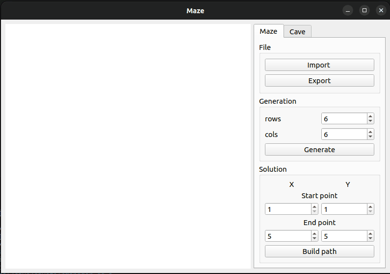

# Maze

Этот проект представляет собой программу для работы с лабиринтами и симуляцией пещер. Лабиринт состоит из сетки размером _n_ строк на _m_ столбцов, с "тонкими стенами" между ячейками. Пещера представляет собой симуляцию клеточного автомата в виде матрицы клеток. Программа также предоставляет графический пользовательский интерфейс на базе Qt. Этот интерфейс позволяет загружать лабиринты, генерировать идеальные лабиринты, отображать их решение и проводить симуляцию пещер.



## Установка
Для установки достаточно прописать команду `make` в корне проекта. Если на устройстве присутствуют все необходимые компоненты, программа будет установлена и сразу же запущена.

## Описание Лабиринта

Лабиринт хранится в файле в формате, содержащем количество строк и столбцов, а также две матрицы, описывающие положение вертикальных и горизонтальных стен между ячейками.

Пример файла лабиринта:

```
4 4
0 0 0 1
1 0 1 1
0 1 0 1
0 0 0 1

1 0 1 0
0 0 1 0
1 1 0 1
1 1 1 1
```

## Описание Пещеры

Пещера представляет собой симуляцию клеточного автомата и хранится в файле, содержащем количество строк и столбцов, а также матрицу, описывающую состояние клеток.

Пример файла пещеры:

```
4 4
0 1 0 1
1 0 0 1
0 1 0 0
0 0 1 1
```